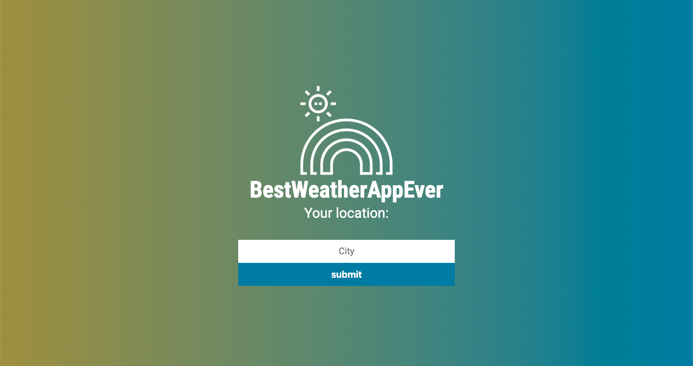
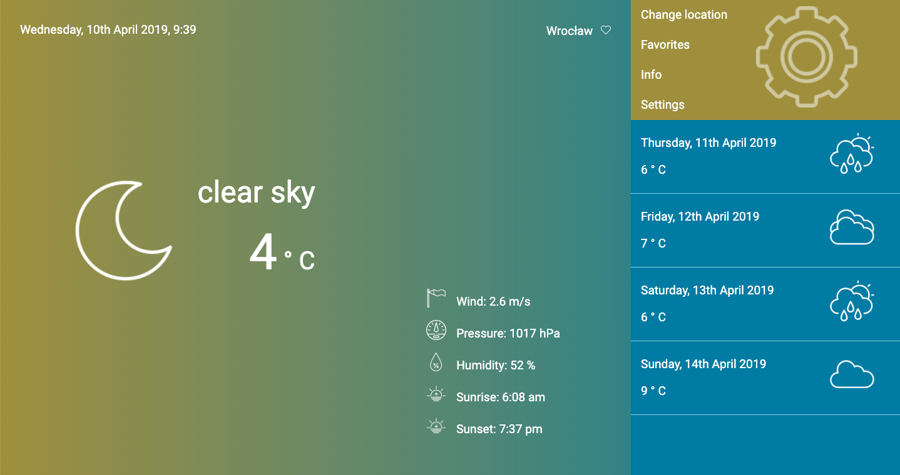

# Weather App
> A simple weather app created using Node.js and Webpack. The app shows current weather in a given location as well as forecast for the next 4 days.

## Table of contents
* [General info](#general-info)
* [Technologies](#technologies)
* [Setup](#setup)
* [Features](#features)
* [Screenshots](#screenshots)
* [Authors](#authors)
* [Credits](#credits)

## General info
The project was created during the third edition of the CodersCamp. It uses https://openweathermap.org/api for fetching the weather data.
The API provides forecast in 3-hour time spans, which we merged info full days in order to provide more readable data.
Since OpenWeatherApi provides UTC times only, we used another API - https://timezonedb.com/ to find the time zone a specific city is in.
We also used the moment.js npm package in order to convert time into local time zones and add proper formatting to dates.

## Technologies
* JavaScript
* CSS
* HTML
* Webpack
* Node.js

## Setup
The project requires Node.js installed.

```bash
npm install
npm run build
```

## Features

* Geolocation and showing weather by coordinates
* Showing weather by user query
* Showing weather by query stored in the local storage (the latest correct query)

To-do list:
* A feature of adding cities to "Favorites"
* Adding more detailed weather information to the forecast
* Temperature graph

## Screenshots





## Authors
* https://github.com/KamilaCoder
* https://github.com/Aaspyr
* https://github.com/lamadrugada
* https://github.com/MarcinCzajka

## Credits

Credit to authors of icons:
* Icons made by https://www.freepik.com/ from https://www.flaticon.com/ are licensed by http://creativecommons.org/licenses/by/3.0/ 
* Icons made by https://www.flaticon.com/authors/iconixar from https://www.flaticon.com/ are licensed by http://creativecommons.org/licenses/by/3.0/
* Icons made by https://www.flaticon.com/authors/smashicons from https://www.flaticon.com/ are licensed by http://creativecommons.org/licenses/by/3.0/
